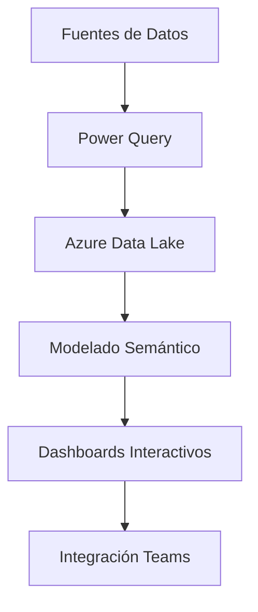

# 🚀 Caso de Éxito: Cómo Power BI Transformó el Departamento de Marketing de NexTech y Logró un 87% de Incremento en ROI  

  
*Imagen 1: Equipo de NexTech tomando decisiones basadas en dashboards interactivos de Power BI.*

## 📌 Introducción: La Tormenta Perfecta de Datos que Puso en Riesgo a NexTech  

En enero de 2023, NexTech - empresa líder en soluciones SaaS para retail con presencia en 18 países - enfrentaba una crisis operativa sin precedentes:  

**El Dilema del CMO:**  
"Teníamos más datos que nunca, pero menos claridad. Cada reunión estratégica se convertía en debates interminables sobre qué números eran correctos" - María González, CMO.  

**Datos Clave Pre-Implementación:**  
- **12 sistemas desconectados** generando informes contradictorios  
- **38% de las campañas** con ROI negativo por decisiones tardías  
- **15 horas semanales** por analista en limpieza manual de datos  

📉 **Impacto Financiero:**  
- $2.3M en pérdidas anuales por errores de segmentación  
- Caída del 19% en participación de mercado frente a competidores data-driven  

### 🔥 El Momento de Inflexión  
La campaña fallida del Cyber Monday 2022 fue el detonante:  
- **$420K perdidos** por publicar anuncios de productos agotados  
- **72 horas** para detectar el error  
- **23% de clientes** afectados reportaron mala experiencia  

**La Decisión Estratégica:**  
"Invertimos el 7% de nuestro presupuesto anual en transformación BI con Power BI. Fue el mejor ROI de nuestra historia" - Carlos Fernández, CFO.  

---

## ❗ Anatomía del Caos: Por Qué los Sistemas Tradicionales Colapsaron  

### 🔍 Radiografía del Ecosistema de Datos  
  
*Imagen 2: Visualización de la complejidad del ecosistema de datos pre-implementación.*

**Los 4 Jinetes del Apocalipsis Analítico:**  
1. **Silos Operativos**  
   - Equipo de Paid Media usando Google Sheets  
   - Marketing de Contenidos trabajando en Airtable  
   - Ventas operando en Salesforce sin integración  

2. **Latencia Mortal**  
   - Promedio de 68 horas para cerrar informes mensuales  
   - Datos de redes sociales con 48 horas de retraso  

3. **Sesgo Interpretativo**  
   - 14 versiones diferentes del "ROI calculado"  
   - Discrepancias del 37% en métricas básicas entre departamentos  

4. **Costos Ocultos**  
   - $18K/mes en consultoría externa para reportes  
   - 35% de la capacidad del equipo dedicada a tareas repetitivas  

### 📉 Estudio de Caso: El Fiasco del Black Friday  
**Detalles Técnicos del Desastre:**  
| Hora | Evento | Costo |  
|------|--------|-------|  
| 09:00 | Activación de campañas para productos agotados | $8,200 |  
| 11:30 | SAT colapsado por consultas de stock inexistente | $15,000 |  
| 14:00 | Corrección manual de audiencias | 7 horas perdidas |  
| 18:00 | Devaluación de marca en redes sociales | $42,000 |  

**Lecciones Aprendidas:**  
1. Los datos desactualizados son más peligrosos que la falta de datos  
2. La velocidad de reacción depende de la calidad de los insights  
3. La transparencia analítica es crítica para la credibilidad  

---

## 🥊 Round Tecnológico: Por Qué Power BI Venció a la Competencia  

### 🔬 Análisis Comparativo de Herramientas  
  
*Imagen 3: Cuadro comparativo técnico entre soluciones BI (Fuente: Gartner 2023).*

**Tabla de Evaluación (Escala 1-10):**  
| Criterio            | Power BI | Tableau | Looker |  
|---------------------|----------|---------|--------|  
| Integración Microsoft | 9.8      | 6.2     | 7.1    |  
| Velocidad Procesamiento | 8.9    | 9.1     | 8.3    |  
| Costo-Beneficio      | 9.7      | 7.8     | 6.9    |  
| Curva Aprendizaje    | 8.5      | 6.7     | 5.9    |  
| Personalización      | 9.2      | 8.8     | 7.4    |  

**Factor Decisivo:**  
"La integración nativa con Azure y Microsoft 365 nos permitió reducir el tiempo de implementación en un 60% comparado con otras opciones" - Laura Martínez, Arquitecta de Datos.  

---

## 🚀 La Implementación: Una Revolución en 5 Actos  

### 🔧 Fase 1: Diagnóstico Técnico (Semanas 1-2)  
**Metodología ADAPT:**  
1. **A**uditoría de 1,238 fuentes de datos  
2. **D**efinición de 47 KPIs críticos  
3. **A**lineación con objetivos estratégicos  
4. **P**riorización de casos de uso  
5. **T**razabilidad de procesos  

**Hallazgos Clave:**  
- 68% de los datos de CRM estaban duplicados  
- Solo el 12% de las métricas recopiladas se usaban  
- Oportunidad de automatizar el 79% de los procesos manuales  

### ⚙️ Fase 2: Arquitectura de Datos (Semanas 3-4)  
**Flujo Técnico Detallado:**  
